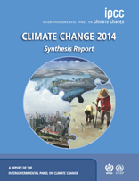
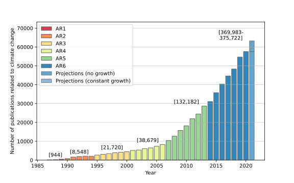

## The IPCC

It is the job of the [IPCC](https://www.ipcc.ch/) to provide comprehensive, objective and transparent assessments of the scientific literature on climate change. The reports, which are published every 6-7, years serve as trusted sources of information across climate science, impacts & adaptation, and mitigation. Because the summaries for policymakers are approved by national governments, the reports are also vital in international climate negotiations and are key tools for holding governments accountable.

The three working groups of the IPCC
- WGI: The Physical Science Basis
- WGII: Impacts, Adaptation and Vulnerability
- WGIII: Mitigation of Climate Change

have all recently published their sixth assessment report, with a synthesis report to published in late 2022 or early 2023

### Comprehensive assessments, an increasingly intractable task

Yet whereas early IPCC reports had hundreds or thousands of scientific studies on climate change to contend with, during the most recent assessment report more than 300,000 studies were published on climate change ([Callaghan et al., 2020](https://www.nature.com/articles/s41558-019-0684-5)). Although the reports have got bigger - involving more authors, comprising more pages, and containing more references - this has not kept pace with the growth in the literature. With the IPCC citing an increasingly small proportion of available relevant literature, the question of what they cite and how this is selected becomes ever more important.

## Evidence synthesis methods

Evidence synthesis ([overview](https://www.lshtm.ac.uk/research/centres/centre-evaluation/evidence-synthesis)) describes a suite of formal methods for selecting and assessing evidence on a research question. These are most frequently used in the medical domain, where important decisions with life-or-death outcomes are rarely made based on single studies, or on "normal" literature reviews (where a single expert or experts select and summarise a literature with no formal procedures for how evidence is selected or assessed).

Evidence synthesis methods prioritise comprehensiveness in the evidence base assessed, as well as transparency in how this is identified, selected and assessed.

## Machine-learning assisted evidence synthesis

Many processes in evidence synthesis, such as screening potentially relevant studies, or coding studies according to the type of evidence they provide, are repetitive and time consuming. As the number of papers grows, these processes present larger and larger challenges to the goal of producing comprehensive assessments.

Repetitive and time consuming tasks are exactly those where machine-learning :computer: :mortar_board: can be helpful. Research is mostly recorded in written texts, so that means the ML tools we are looking for come from the area of Natural Language Processing (NLP).

So far the uses of ML in evidence synthesis are:

- **Identifying relevant studies**: A simple binary classifier can be trained on human screened data (studies labelled with 0, or 1 for relevant) to predict whether documents without labels will be relevant or not
- **Classifying studies**: Machine learning can be used to give useful content labels to studies, either using
  - **Unsupervised** methods like topic modelling, which need no human input but cannot assign to documents to predefined categories; or
  - **Supervised** methods, where models predict the labels of unseen documents, based on the *predefined* labels assigned by humans.

In this tutorial we will be exploring how we can use supervised methods to identify and classify evidence on climate impacts, following a simplified version of a pipeline used in a recent [publication](https://www.nature.com/articles/s41558-021-01168-6.epdf?sharing_token=7Sw0J3PwoQNKriW6TbOuX9RgN0jAjWel9jnR3ZoTv0PwAcRfhcoupIk0A95eY8_-YUKjuCHE46BRE8RXMy_HNaRNTl48Ji0i6-pYLEd3WbQwXQpTp1LscjrMM5Am67huate7yo35BOmH8Yq08b_CuYEhHpq1-SwJh0A5XD6kKvE%3D).
